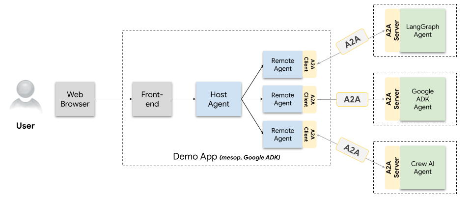

# A2A Demo



在这个基于 A2A 协议的智能体平台中，用户在浏览器端发出指令后，前端会将该请求传给 Host Agent，由它负责解析用户意图、拆解具体子任务，并且并行触发多个 Remote Agent；每个 Remote Agent 通过 A2A Client 将子任务封装为标准的 JSON-RPC 请求，发送给远端对应的 A2A Server，再由后者调用各自擅长的智能体模块（如 LangGraph Agent 负责外汇兑换、Google ADK Agent 负责报销收据、Crew AI Agent 负责根据文字内容来生成图片等）执行并返回结果；最后，Host Agent 汇总并格式化各路反馈，一并呈现给用户，实现多智能体的分工协作与能力互补。

# Sample Code

- agents目录：包含一系列 A2A Agents 示例。
- Demo目录：是要演示的协议实战示例。
- Common目录：Common code that all sample agents and apps use to speak A2A over HTTP. 
- Hosts目录：Host applications that use the A2AClient. Includes a CLI which shows simple task completion with a single agent, a mesop web application that can speak to multiple agents, and an orchestrator agent that delegates tasks to one of multiple remote A2A agents.

## Prerequisites
- Python 3.13 or higher
- [UV](https://docs.astral.sh/uv/)

在根目录创建 .env 文件，写入GOOGLE_API_KEY:
```
GOOGLE_API_KEY=<your_google_api_key>
```
Google_API_Key[申请地址](https://cloud.google.com/docs/authentication/api-keys?hl=zh-cn)

## Running the Samples

Run one (or more) [agent](/samples/python/agents/README.md) A2A server and one of the [host applications](/samples/python/hosts/README.md). 

The following example will run the langgraph agent with the python CLI host:

1. Navigate to the agent directory:
    ```bash
    cd samples/python/agents/langgraph
    ```
2. Run an agent:
    ```bash
    uv run .
    ```
3. In another terminal, navigate to the CLI directory:
    ```bash
    cd samples/python/hosts/cli
    ```
4. Run the example client
    ```
    uv run .
    ```
---
**NOTE:** 
This is sample code and not production-quality libraries.
---

## issue
https://github.com/huangjia2019/a2a-in-action/issues/1